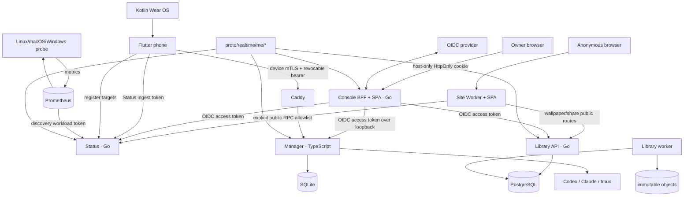

# Realtime Me 统一架构

状态：目录、契约、移动端、采集侧、Web 入口与 owner 鉴权已完成破坏性收敛。

基线日期：2026-07-18

## 1. 架构结论

`cloud-driver` 与 `super-manager` 已并入 `realtime-me` 单仓库。统一的是源码治理、Proto、
Web 入口、owner 身份、UI 基础设施和验证入口；三个 bounded context 仍保持独立进程、存储
和故障域：

- **Status**：设备、Watch、跨平台采集、Prometheus、公开状态；
- **Library**：云盘、书籍、音乐、图片、壁纸、分享与本地内容处理；
- **Manager**：Codex/Claude Code、AG-UI、PTY、工作区与设备配对。

明确不做：共享数据库、跨服务读取内部包、万能 workload token、旧新路由双栈、旧配置
fallback、多个私有前端重复登录，以及把 Manager 设备身份改造成浏览器身份。

## 2. 当前运行图



依赖方向固定为：transport/application adapter → application/domain port → store/provider。
Console 只做登录、会话、CSRF 和反向代理，不导入三个业务服务的实现或存储。

## 3. 两个 Web 应用

### Site

`apps/web/site` 是唯一匿名入口，包含：

- Status、Profile 与 Projects；
- Wallpapers；
- `/s/:token` 与 `/share/:token` 匿名只读分享。

Worker 只代理源码中显式列出的公开 RPC/文件前缀，并在转发前删除 `Authorization` 与
`Cookie`。内部 Status、Library 管理和 Manager 路由无法从 Site 到达。

### Console

`apps/web/console` 是唯一 owner 后台，包含：

- Status 内部状态与 Metrics；
- Library Drive、Books、Music、Images；
- Manager runtime、workspace 与 paired-device 管理。

浏览器只访问同源 `/api/status`、`/api/library`、`/api/manager`。Console BFF 持有
browser-bound state + authorization-code + PKCE 获得的 token source，在服务器内存中维护有界会话，并向上游
注入短期 access token。前端没有 token 输入框，也不使用 `localStorage` 保存身份凭据。

共享层：

- `packages/web-ui`：shadcn/Radix 基础组件；
- `packages/web-shell`：主题、Console 导航和页面骨架；
- `packages/status-web`：可分别挂载到 Site/Console 的 Status feature；
- `packages/library-web`：Library API、上传、查询和业务组件；
- `packages/*-contracts-web`：按消费者生成的 Proto 契约。

## 4. 统一 owner 鉴权

`proto/realtime/me/auth/v1` 是唯一 owner capability 模型：

| Permission | 服务端用途 |
| --- | --- |
| `PERMISSION_STATUS_INTERNAL_READ` | Status internal status 与 Metrics |
| `PERMISSION_LIBRARY_MANAGE` | Library 私有 RPC、上传和文件读取 |
| `PERMISSION_MANAGER_CONTROL` | Manager 观察与控制 |

OIDC provider 必须把 canonical `permissions` string array 放入 ID token 与 access token，
并为三个服务签发相同的 owner audience（建议 `realtime-me`）。Console 用 ID token 投影导航，
每个服务仍独立校验 access token 的 issuer、audience、expiry、subject 与 permission；前端
隐藏导航不构成授权。

Status、Library 和 Manager 只在首个 owner JWT 请求时执行有界 OIDC discovery 并缓存 JWKS；
IdP 短时不可用不会阻止公开读、Status workload 或 Manager device 路径启动。Console 登录本身
依赖 IdP，不做本地密码 fallback。

不同主体不合并：

| 主体 | 凭据 | 原因 |
| --- | --- | --- |
| Anonymous | 无；仅显式公开路由/分享 token | 最小公开面 |
| Owner browser | Console session → OIDC access token | 统一登录与权限 |
| Status producer | ingest token | 无人值守写入 |
| Prometheus | discovery token | 只允许 scrape target discovery 与 gateway process scrape |
| Manager Flutter device | mTLS + revocable bearer | 设备证明、吊销与公网直连 |

Manager 的 owner OIDC 路径由 Console 通过 `127.0.0.1:3080` 到达；设备公网 hostname 仍由
Caddy 强制 mTLS，因此增加 Console 不会降低手机端入口强度。

## 5. 目录结构

```text
apps/
├── mobile/                         # 唯一 Flutter 手机 APK
├── watch/                          # Kotlin Wear OS
└── web/
    ├── site/                       # 匿名 SPA + Worker
    └── console/                    # owner SPA
services/
├── status/                         # Go
├── library/                        # Go API/worker/migrate
├── manager/                        # TypeScript/Fastify
└── console/                        # Go OIDC BFF/static host
libs/go/authn/                      # Go 服务共享 OIDC verifier
packages/
├── auth-contracts-web/
├── status-contracts-{web,dart}/
├── library-contracts-web/
├── manager-contracts-{web,dart}/
├── status-web/
├── library-web/
├── web-shell/
└── web-ui/
proto/realtime/me/
├── auth/v1/
├── status/v1/
├── site/v1/
├── library/*/v1/
└── manager/*/v1/
```

根目录保持一个 pnpm lockfile、一个 Go module/vendor、一个 Buf module 和一个 Makefile。
生成代码只由 `pnpm generate` / `make generate` 产生，不手改、不重复建模。

## 6. 手机与采集 Agent

手机只有 `me.realtime` Flutter APK；Android native core 继续负责 Flutter engine 不存在时
仍必须运行的 Wear listener、前台同步、WorkManager、Keystore 与设备状态采集。Wear OS
保持 Kotlin 原生应用。

Linux、macOS、Windows 统一运行 `scripts/probe/realtime_probe` 的同一 Python 采集核心，
安装器只适配 systemd、launchd 与 Task Scheduler。Linux `aarch64`（包括 64 位 Raspberry
Pi OS）属于支持范围；采集协议和指标不按 CPU 架构分叉。Manager 服务能否运行在 ARM64
还取决于固定版本 Codex/Claude CLI 与 `node-pty` 的目标平台产物，不能由 Probe 支持推导。

## 7. 发布边界

单仓库不等于单进程或单次全量发布：

1. `deploy/edge`：唯一 cloudflared connector；
2. `deploy/status`：Status、Prometheus 与 exporters；
3. `deploy/library`：PostgreSQL、migrate、API 与 worker；
4. `deploy/manager`：Manager、Console、Caddy、tmux 与 ddns-go；
5. `deploy/web`：Site Worker 发布说明。

Library migration 保持 forward-only 与迁移前备份。Manager/Console 运行在专用 systemd
边界；Console 使用独立 dynamic user。Site 发布不触发任何数据库迁移。

## 8. 一次性切换

本迁移删除旧 `apps/web/status`、七个 `apps/web/library/*`、Library 密码会话 Proto/实现、
Status browser query token 和独立 Pages 发布脚本。不保留 redirect app、兼容配置键或双轨
鉴权。

切换顺序：

1. 配置 OIDC confidential client、audience 与三项 permission mapper；
2. 发布三项服务的新 issuer/audience 配置；
3. 构建并启动 Console BFF，验证三项 downstream permission；
4. 发布 Site Worker；
5. 删除旧 Pages/Worker route 与旧 Library password/session secret；
6. 外部验收后归档旧部署资源。

## 9. 验收门禁

```sh
pnpm generate
buf lint
go vet ./...
go build ./...
pnpm check
pnpm build
make verify-ops
```

运行时至少验证：

- Site 只能访问 public Status、wallpaper 与 token-scoped share；
- 未登录 Console 跳转 OIDC，退出后 server-side session 立即失效；
- 三项 permission 分别允许/拒绝对应服务，任一服务不信任前端导航；
- Console 的状态变更请求拒绝跨 Origin；
- Manager 设备 mTLS 流程、pairing、AG-UI 与 PTY 不受 owner OIDC 影响；
- 停止任一 bounded context 不阻断另外两个，敏感数据不进入 Status 指标或日志。
