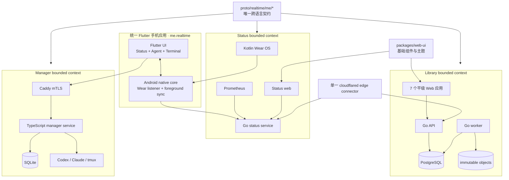

# realtime-me 项目整合方案

状态：Proposed

盘点基线：2026-07-18

## 1. 结论

将 `cloud-driver` 和 `super-manager` **一次性并入 `realtime-me` 单仓库**，但不把三套业务压成一个进程、一个数据库或一套认证。

目标形态是“统一源码、契约、工具链和发布治理，保留清晰的业务边界与独立故障域”：

- Status：设备、Watch、Prometheus、公开状态与个人站点；
- Library：云盘、书籍、音乐、图片、壁纸、分享和本地内容处理；
- Manager：Codex/Claude Code 结构化控制、PTY、设备配对与 Flutter 客户端。

手机端收敛为单一 `me.realtime` Flutter APK，承载 Status、Agent 和 Terminal；Wear OS 继续使用 Kotlin 原生应用。

明确拒绝：

- Git submodule、长期 subtree 同步或复制后双向回灌；
- 把 Go/TypeScript 服务重写成同一种语言；
- 共用数据库、全局“万能认证”或跨业务直接读取对方存储；
- 同时保留 Kotlin Status 手机应用和 Flutter Manager 手机应用；
- 为了“全 Flutter”把必须脱离 UI 进程运行的 Wear/前台服务硬搬进 Dart isolate；
- 为旧 Proto 路径、旧配置键或旧服务并行保留兼容层。

## 2. 当前盘点

| 项目 | 基线提交 | 主要技术 | 状态与规模（不含生成代码/依赖） |
| --- | --- | --- | --- |
| `realtime-me` | `b0ade40` | Kotlin/Gradle、Go、React/Vite、Python、Prometheus、Cloudflare Worker | 工作树干净；约 20K 行 |
| `cloud-driver` | `a24e143` | Go/ConnectRPC/PostgreSQL、React/Vite、Cloudflare Pages/Tunnel | 工作树干净；约 43K 行 |
| `super-manager` | `811880a` | TypeScript/Fastify/SQLite、AG-UI、Flutter、Caddy/systemd/DDNS | 工作树干净；约 18K 行；当前无 Git remote |

三个项目合计约 82K 行手写代码。重复主要集中在：

- Buf/Protobuf 生成与配置；
- Node/pnpm/npm 工作区、TypeScript 和格式化工具；
- React 19、Tailwind、Radix/shadcn 基础组件；
- Cloudflare Tunnel 与主机发布脚本；
- ConnectRPC 依赖和 Go 构建链。

不应合并的部分：

- Status 的 Prometheus/设备模型、Library 的内容模型、Manager 的执行模型；
- Status 小型状态文件、Library PostgreSQL + 对象库、Manager SQLite + PKI + tmux；
- Status token、Library owner session、Manager mTLS + bearer；
- Wear OS 的 Health Services/Data Layer 原生采集与 Manager 的 Agent/PTY 业务模型。

## 3. 目标架构



边界规则：

1. 服务只依赖本业务的 domain/application ports 和生成契约，不导入其他服务实现。
2. 跨业务展示只通过显式 URL 或公开 RPC；不得直接读其他业务的数据库、状态文件或内部包。
3. Status 可通过 Prometheus观察 Library/Manager 的运行健康，但不得读取 Manager thread/prompt 或 Library 内容元数据。
4. AG-UI 继续作为 Manager 的 Agent 事件协议；不再用 Proto 定义一套平行聊天模型。
5. PTY 字节仍使用独立的 Manager terminal Proto/WebSocket，不混入 AG-UI。

## 4. 目标目录

```text
realtime-me/
├── apps/
│   ├── mobile/                         # 单一 Flutter 手机应用；以 Manager Flutter 客户端为基座
│   │   └── android/                    # Wear listener、前台同步、WorkManager、Keystore
│   ├── watch/                          # Kotlin Wear OS；与 mobile 同 applicationId/signing
│   └── web/
│       ├── status/                     # 原 apps/status-page
│       └── library/
│           ├── auth/
│           ├── drive/
│           ├── books/
│           ├── music/
│           ├── images/
│           ├── wallpapers/
│           └── share/
├── services/
│   ├── status/                         # Go status gateway
│   ├── library/                        # Go API、worker、migrate
│   └── manager/                        # TypeScript/Fastify service + smctl
├── packages/
│   ├── status-protocol-android/        # Kotlin/Javalite + Data Layer helpers
│   ├── status-contracts-web/           # 生成的 TS
│   ├── status-contracts-dart/          # 手机 Status UI 使用的生成 Dart 契约
│   ├── library-contracts-web/          # 生成的 TS
│   ├── manager-contracts-dart/         # 生成的 Dart
│   ├── web-ui/                         # 共享 shadcn/Radix 基础组件和主题 token
│   ├── library-web/                    # Library API、认证、上传和业务组件
│   └── ag-ui-dart/                     # 固定、最小的 AG-UI Dart fork
├── gen/go/                             # 所有 Go Proto 生成物
├── proto/realtime/me/
│   ├── status/v1/
│   ├── site/v1/
│   ├── library/{auth,books,content,drive,images,music,system,wallpapers}/v1/
│   └── manager/{control,terminal}/v1/
├── deploy/
│   ├── edge/                           # cloudflared 与共享 edge network
│   ├── status/                         # Prometheus/status 独立发布单元
│   ├── library/                        # PostgreSQL/API/worker/migrate 独立发布单元
│   ├── manager/                        # Caddy/systemd/ddns-go
│   └── web/                            # Worker/Pages 项目与 Origin 配置
├── scripts/                            # 保持现有公开下载路径不变
├── go.mod
├── package.json
├── pnpm-lock.yaml
├── pnpm-workspace.yaml
├── buf.yaml
├── Makefile
└── settings.gradle.kts
```

`scripts/install-linux-probe.sh`、`scripts/install-macos-probe.sh`、`scripts/probe/*` 和 `scripts/operator/*` 已有公开 URL 契约，整合时不得移动或改为另一套下载路径。

## 5. 契约治理

### 5.1 新包名

执行一次破坏性包迁移：

- `realtime.me.v1` → `realtime.me.status.v1` / `realtime.me.site.v1`；
- `cloud.*.v1` → `realtime.me.library.*.v1`；
- `super_manager.control.v1` → `realtime.me.manager.control.v1`；
- `super_manager.terminal.v1` → `realtime.me.manager.terminal.v1`。

目录严格匹配包名。所有 ConnectRPC 路由、Worker 代理白名单、Caddy pairing 路由和客户端引用在同一迁移中更新，不保留旧路由 alias。

### 5.2 迁移约束

- 本轮只调整命名空间、生成位置和已有校验的归属；保持 field number、oneof 和枚举编号不变。
- 不趁整合重画业务消息，不增加“未来可能使用”的字段。
- 将已经存在于各语言边界的确定性约束迁入 Protovalidate；不凭空发明规则。
- 保持 Buf `STANDARD` lint；整合提交建立新的 breaking baseline，之后对新主线执行 `FILE` breaking 检查。
- 每个 RPC 保持独立 Request/Response；错误继续使用 transport status，不增加平行 `error_message`。
- 生成代码只由根目录生成入口产生并提交；禁止手改。

### 5.3 按消费者生成

根 `buf.yaml` 管理唯一模块，根生成命令依次使用三份受控模板：

- Status：Go、TypeScript、Kotlin/Javalite、Dart；
- Library：Go、TypeScript；
- Manager：TypeScript、Dart。

这样保持单一 IDL，又不会让公开 Status bundle 引入全部 Manager/Library 生成代码。

## 6. 工具链与依赖

### 6.1 根级统一

- JavaScript/TypeScript：Node `24.18.0`、pnpm `11.10.0`、一个根 lockfile；删除 `package-lock.json` 和子仓库 lockfile。
- Go：一个根 module `github.com/pood1e/realtime-me`，统一依赖版本和根 `vendor/`；不同服务继续保留自己的 `internal` 边界和 Dockerfile。
- Proto：一个 Buf module、一个 lint/breaking policy、一个 `make generate` 入口。
- JS/TS/CSS/JSON：统一使用 Biome；删除与其覆盖范围重叠的 Prettier 配置和脚本。
- Android：根 Gradle multi-project 只构建 Wear app 与共享 Android protocol；Flutter Android host 引用同一个 protocol module。
- Flutter：`apps/mobile` 是唯一手机应用；保留 Flutter/Dart 官方工具链，不强行纳入根 Gradle 或 pnpm 构建图。
- 顶层 `Makefile` 只做跨语言编排；各语言仍调用官方 formatter、analyzer、compiler 和 codegen。

候选固定基线采用三个项目中已经运行的较新版本：Go `1.26.5`、Flutter `3.44.6` / Dart `3.12.2`、Pigeon `27.2.0`、TypeScript `7.0.2`、Vite `8.1.3`、ConnectRPC `2.1.2`。实施开始时先按各项目官方 release 文档核验稳定版，再一次性写入根 catalog/manifest；整合期间不再夹带版本升级。

Codex CLI `0.144.5` 与 Claude Code CLI `2.1.195` 是 Manager 私有协议的一部分，整合期间必须保持精确固定并重新跑目标 Linux 探针，不能跟随普通依赖升级。

### 6.2 只提取真实复用

提取：

- Status 与 Library 重复的 Button、Badge、Card、Dialog、Input、Tabs、Tooltip、主题 token 和 `cn` 到 `packages/web-ui`；
- Cloudflare/Vite 中可证明一致的安全 header 与 URL 校验；
- 根级 Connect/Protobuf/React 版本 catalog。

不提取：

- Library 的 auth guard、upload、drive view、播放器等业务组件；它们进入 `packages/library-web`；
- 两个 Go 服务的 transport/domain/store；当前没有稳定的跨业务抽象；
- Manager 的 provider adapter、AG-UI event store、PTY 或 PKI；
- 一个无边界的 `shared`/`utils` 大包。

## 7. 客户端与认证决策

### 7.1 手机统一为 Flutter

- `apps/mobile` 是唯一手机 APK，以现有 Manager Flutter 客户端为 UI/导航基座，合入 Status 连接、Watch 状态和设置页面。
- 复用现有 Riverpod、go_router、Material 3、AG-UI、ConnectRPC、secure storage 和 xterm.dart，不引入第二套状态管理或导航。
- Android application ID 固定为 `me.realtime`，使用现有 Status 手机应用的签名、`minSdk 26` 和 `targetSdk 37`，以继续满足 [Wear Data Layer](https://developer.android.com/training/wearables/data/overview) 的同包名、同签名要求。
- `apps/watch` 保持 Kotlin/Wear 原生实现；“手机 Flutter 化”不包含把 Health Services 或 Watch 后台采集迁到 Dart。
- 删除原 Compose 手机 UI 和 `dev.supermanager.super_manager` 独立 APK；最终只有 `me.realtime` 手机应用与 `me.realtime` Wear 应用。

### 7.2 Flutter 与 Android 原生边界

Flutter 负责可见 UI 和 Manager 交互，Android native core 负责必须在 Flutter engine 不存在时仍工作的能力：

- `WearableListenerService`、Data Layer snapshot 接收与本地持久化；
- 10 秒 Status gateway 前台同步、WorkManager 恢复、boot/package receiver；
- Android Keystore 中的 Status ingest token；
- Bluetooth accessory、Nintendo presence 和 Android device identity；
- notification/foreground-service lifecycle 与 LAN cleartext host 限定。

桥接采用 Flutter 官方 [Pigeon](https://pub.dev/packages/pigeon) 生成同一应用内的 Dart/Kotlin Host API 与 Event Channel；生成两端不得拆到不同 package。桥接只传 primitive、状态 revision 和序列化 Proto bytes，Watch/Status 领域字段继续只在 Proto 中定义，不再创建 Map/JSON DTO。

原生服务独立写入并上报状态；Flutter 页面只读取 snapshot 和订阅变化，不能成为后台同步存活的前提。该边界遵循 Flutter 官方 [platform channels](https://docs.flutter.dev/platform-integration/platform-channels) 与 [background processes](https://docs.flutter.dev/packages-and-plugins/background-processes) 能力，同时保留 Android 官方建议的 manifest `WearableListenerService` 事件入口。Wear Data Layer 仍直接使用 Google Play services 官方 API，不由第三方 Flutter 插件代替。

### 7.3 应用身份与凭据迁移

- 统一 APK 沿用 `me.realtime`，因此现有 Status 应用可原位升级；保留原 Keystore alias、encrypted preferences key、Data Layer path 和签名。
- 原 Manager APK 的 application ID 不同，Android 沙箱不允许新应用读取其 secure storage。切换时必须为统一应用重新配对，成功后吊销旧 Manager device certificate/bearer 并卸载旧 APK。
- 不实现跨应用凭据导出、临时 ContentProvider、shared user 或双应用同步兼容层。
- 统一应用关闭 Android backup；Status token、Manager PKCS#12/bearer 和配对材料不得进入系统备份。

### 7.4 三个安全域不合并

| 边界 | 保留方案 |
| --- | --- |
| Status | public read；内部 query token；ingest token 独立 |
| Library | owner password + Host-only session；公开 wallpaper/share 只读 |
| Manager | pairing secret → device mTLS + revocable bearer |

Status 的 Apps 页面只保存外部应用 URL，不获得 Library session 或 Manager device 权限。Library 与 Manager 均不得复用 Status query/ingest token。

## 8. 部署与运行时

单仓库不等于单发布单元。服务端与 Web 最终保留五个发布单元：

1. `edge`：唯一 `cloudflared` connector 与外部命名 Docker network；
2. `status`：status service、Prometheus、node-exporter、可选 cAdvisor；
3. `library`：PostgreSQL、migrate、API、worker；
4. `manager`：专用 Unix 用户、systemd、tmux、Caddy、ddns-go；
5. `web`：Status Worker 与七个 Library Pages 应用。

Android 交付固定为两个 artifact：一个统一 Flutter phone APK、一个 Kotlin Wear APK；二者同 application ID、同签名但面向不同 form factor。

网络：

```text
edge network:       cloudflared -> status-service / library-api
status-backend:     status-service <-> prometheus/exporters
library-backend:    library-api/worker/migrate <-> postgres
provider-egress:    library-worker -> music providers
host loopback:      Caddy -> manager-service:3080
```

关键决策：

- 移除 Status 和 Library 各自的 cloudflared，改由 `deploy/edge` 唯一持有 Tunnel token；
- Status 与 Library 使用稳定 network alias 接入 edge，但保持独立 Compose project；
- Library 发布仍执行备份、校验和 forward-only migrate，不因 Status 发布被触发；
- Manager 不容器化：它需要专用用户的 CLI 登录、工作区、tmux socket 和严格 systemd 权限；
- Manager 的 DDNS/Caddy 直连与 cloudflared 出站连接可共存，二者不共享认证或入口；
- 不在本次源码整合中改名现有数据卷、对象目录、Android ID、Manager PKI/home 等持久身份；它们是外部资源标识，不是兼容代码路径。

应用设置仍按 bounded context 分文件且 unknown key fail-fast；Compose/systemd 只持有端口、路径和进程 wiring。不得创建包含所有业务 secret 的根 `.env`。

## 9. 实施顺序

所有开发在一个 integration branch 完成；源仓库从冻结点起只读。生产环境只在最终维护窗口切换一次，不并行运行两套写路径。

### 阶段 0：冻结与可恢复基线

1. 为三个提交创建不可变 tag；推送已有 remote。
2. `super-manager` 无 remote，先创建完整 `git bundle` 和离线校验和。
3. 记录所有部署 artifact、域名/Origin 名称、应用签名、service account、volume/bind mount 和 secret 文件路径，但不把值写入仓库。
4. 完成 Library PostgreSQL + objects 一致性快照、Status volume 备份、Manager SQLite + PKI + provider home 备份。

退出条件：三个旧版本可从 tag/bundle 独立恢复，数据恢复演练通过。

### 阶段 1：保留历史地导入

1. 在临时 clone 使用 `git filter-repo` 把两个仓库重写到隔离前缀。
2. 通过保留父提交的 merge 导入 `realtime-me`，不得直接复制工作树或 squash 全部历史。
3. 立即按目标目录移动；旧前缀不作为长期目录保留。
4. 合并 `THIRD_PARTY_NOTICES.md`，保留 AG-UI Dart fork 等上游版权与许可说明。

退出条件：`git log --follow` 能追溯两个源仓库的重要文件；仓库中无嵌套 `.git`、submodule 或同步脚本。

### 阶段 2：统一目录和构建根

1. 建立根 pnpm workspace、单 lockfile、根 Go module/vendor、根 Buf module 和根 Makefile。
2. 移动 Gradle/Flutter/Go/TS 模块，先只改 import/path，不改业务行为。
3. 删除重复根 manifest、生成配置、格式化配置和无效脚本。
4. 固定工具版本并生成完整依赖锁。

退出条件：三个业务可分别生成、静态检查和编译。

### 阶段 3：一次性契约迁移

1. 移动 Proto 到 `realtime/me/{status,site,library,manager}`。
2. 更新 package、Go/TS/Dart/Kotlin 生成目标和 import。
3. 更新全部 ConnectRPC URL、Worker proxy allowlist、CORS、Caddy PairDevice matcher、Flutter/Kotlin 客户端。
4. 删除旧生成目录和旧 RPC 路径；建立新 breaking baseline。

退出条件：搜索不到 `package cloud.`、`package super_manager.`、旧 Connect 路由或手写平行 DTO。

### 阶段 4：手机 Flutter 收敛

1. 将原 Manager Flutter 工程移动为 `apps/mobile`，切换到 `me.realtime` application ID 和 Status 签名配置。
2. 把现有 Kotlin 手机端的 Wear listener、foreground sync、WorkManager、receiver、Keystore、设备状态读取和 gateway client 移入 Flutter Android host；删除 Compose Activity/ViewModel/UI。
3. 新增 Pigeon Host API/Event Channel，Dart 侧只消费生成接口与序列化 Status Proto；不得复制 Kotlin DTO。
4. 在 Flutter 中实现 Status feature，并与现有 Agent、Workspace、Thread、Terminal、Pairing feature 组成一套 Material 3 导航。
5. 合并 Manifest 权限、network security config、BuildConfig gateway endpoints、backup 禁止规则和前台服务声明。
6. 删除原 Manager 独立 APK 产物、旧 package 配置和第二套手机发布脚本。

退出条件：仓库只生成一个手机 APK；Flutter engine 被杀、UI 未启动和设备重启后，Watch 接收及 Status 前台同步仍由 native core 正常工作。

### 阶段 5：Web 复用收敛

1. 提取 `packages/web-ui`，让 Status 和 Library 删除重复基础组件。
2. 将原 `@cloud-drive/shared` 拆成 `web-ui` 与 `library-web`；禁止把 Library 业务 API 泄漏给 Status。
3. 统一 React/Connect/Buf/TypeScript 依赖版本和 Biome 规则。
4. 保持 Go 服务和 Manager adapters 各自架构，不做无收益重写。

退出条件：基础 UI 只有一个实现；各业务只能导入允许的 package。

### 阶段 6：部署收敛与演练

1. 建立独立 `edge/status/library/manager/web` 部署目录。
2. 迁移到单 cloudflared connector；更新 Library restricted release policy，不放宽 Docker/sudo 权限。
3. 为新配置生成一次性转换清单；服务只读取新键，不实现旧键 fallback。
4. 在隔离主机从备份恢复全部状态，完成 Compose/Caddy/systemd 渲染和启动演练。

退出条件：隔离环境可从空工作树 + 备份启动完整套件，且各发布单元可独立重启。

### 阶段 7：单次生产切换

1. 开始维护窗口，停止旧 Library 写入、Status ingest 和 Manager execution。
2. 再做一份最终一致性备份并记录对象/数据库/volume 校验和。
3. 安装整合仓库；先启动 Library migrate，再启动 Library/Status，随后 edge 和 Manager。
4. 部署全部 Web artifact；用 Status 原签名发布统一 Flutter phone APK，并更新 Watch APK。
5. 在统一应用中重新完成 Manager pairing，验证后吊销旧 Manager device，再卸载旧 Manager APK。
6. 切换 Tunnel ingress、Worker/Pages 环境与 Caddy 路由；旧进程不再启动。
7. 完成运行时验收后归档两个源仓库，并把 README 指向新仓库。

回退边界：

- Library schema 尚未迁移且没有新写入：可直接恢复旧进程；
- 已越过 forward-only migration 或产生新写入：不得覆盖为旧 binary，只能向前修复，或停机恢复同一时点的 PostgreSQL + objects 完整快照；
- Proto 路由不做双栈，因此切换窗口内短暂不可用是预期行为。

## 10. 建议提交批次

1. `chore(repo): import cloud-driver history`
2. `chore(repo): import super-manager history`
3. `refactor(repo): establish consolidated workspace layout`
4. `build: unify pnpm go buf and verification entrypoints`
5. `refactor(proto): establish realtime me bounded packages`
6. `refactor(mobile): consolidate phone clients on Flutter`
7. `refactor(web): extract shared ui and library web packages`
8. `refactor(deploy): separate edge status library and manager units`
9. `docs: add consolidated operations and cutover runbooks`

每批只做一个变化原因；不加入兼容 wrapper、deprecated alias、临时双配置或双 lockfile。

## 11. 验收门禁

### 静态与构建

```sh
make generate
git diff --exit-code -- proto gen packages/*-contracts-* services/*/src/gen
buf lint
go vet ./...
go build ./...
pnpm exec biome check .
pnpm -r --if-present typecheck
pnpm -r --if-present build
./gradlew :apps:watch:lintDebug :apps:watch:assembleDebug
(cd apps/mobile && flutter analyze && flutter build apk --debug)
(cd apps/mobile/android && ./gradlew app:lintDebug)
find deploy scripts -type f -name '*.sh' -print0 | xargs -0 -n1 bash -n
find deploy scripts -type f -name '*.sh' -print0 | xargs -0 shellcheck --severity=warning
docker compose -f deploy/edge/compose.yaml config --quiet
docker compose -f deploy/status/compose.yaml config --quiet
docker compose -f deploy/library/compose.yaml config --quiet
caddy validate --config deploy/manager/host/Caddyfile
```

不得通过放宽 lint、加入 ignore 或保留生成漂移来过门禁。

### 运行时验收

- Mobile：Status/Agent/Terminal/Settings 导航、原 Status token 原位升级、Manager 重新配对、旧 device 吊销；
- Status：watch → native phone core → gateway、Flutter engine 未运行、后台/重启、LAN/public fallback、Prometheus scrape、公开/内部状态、GitHub 状态同步；
- Library：登录/退出、上传续传、worker 处理、下载、回收站、分享/壁纸匿名边界、三种音乐 provider、备份/恢复；
- Manager：pairing、mTLS + bearer、runtime 探针、AG-UI replay/Ask/cancel/steer、PTY attach/resize/detach、服务重启后的 LOST 语义；
- Edge：Status/Library 每个 Host 的路由、CORS、Cookie、SSE、WebSocket、Range 下载和大文件上传；
- 隔离性：停止任一 bounded context 不应阻断另外两个；Library/Manager 敏感数据不得出现在 Status API、指标或日志中。

## 12. 主要风险

| 风险 | 控制措施 |
| --- | --- |
| Proto package 改名使所有 Connect URL 同时失效 | 单维护窗口原子部署；不双栈；新 baseline 后恢复 breaking gate |
| 合并 Go module 后发生传递依赖升级 | 根 vendor；先 `go mod graph` 审核，再 vet/build 全部 Go package |
| 两套 React UI 提取时引入视觉/行为回归 | 只提取基础组件和 token；业务组件不泛化；逐应用 typecheck/build |
| 单 Tunnel 配置错误扩大公网入口影响 | edge 独立发布、显式 Host 路由、稳定 network alias、逐 Host 外部验收 |
| Library forward-only migration 无法 binary rollback | 迁移前一致性备份；旧写路径停机；失败只向前修复或整组恢复 |
| Manager 私有 CLI wire 随版本变化 | 整合期间保持精确 CLI 版本；目标 Linux 重新 probe；不增加 fallback adapter |
| Flutter UI 进程退出后 Status 后台链路中断 | Wear listener、前台服务、WorkManager 和 token store 留在 native core；以无 Flutter engine、重启和 Doze 场景验收 |
| 合并 application ID 后 Manager 客户端凭据不可迁移 | 以 `me.realtime` 保住 Status 升级链；Manager 明确重新配对并吊销旧 device；服务端 PKI/历史不变 |
| 导入丢失源码历史或第三方许可 | `git filter-repo` + merge 保留父历史；导入 notices；无 squash-copy |

## 13. 完成定义

只有同时满足以下条件才算整合完成：

- 两个源仓库已归档，后续开发只发生在 `realtime-me`；
- 根目录只有一套 pnpm、Go、Buf 治理和生成入口；
- 手机端只发布一个 `me.realtime` Flutter APK，Watch 仍为同包名、同签名的 Kotlin Wear APK；
- 三个 bounded context 没有反向实现依赖、共享数据库或共享万能凭据；
- 旧 Proto/配置/部署路径不再被任何运行时读取；
- 全部静态、构建、配置渲染和运行时验收通过；
- 可仅凭整合仓库、受控 secret 和最新备份在隔离主机完成恢复。
