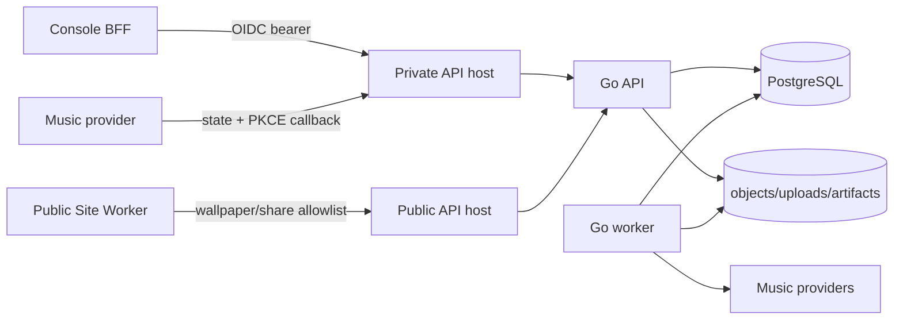

# Library architecture

Library is one bounded context inside the monorepo. It owns content metadata,
objects, processing, provider credentials, and its public sharing policy; it does
not own browser identity or a standalone frontend.

## Runtime



The private and public hostnames reach one API process, but Host routing creates
two disjoint handler trees:

- private: ConnectRPC, uploads, source/derived files, provider management;
- public: wallpaper reads, anonymous image assets, and token-scoped read-only
  shares;
- provider callback: the only unauthenticated private-host GET, protected by
  one-time state and PKCE and redirected to the fixed Console origin.

Unknown hosts return 404. Library does not emit CORS because browsers reach it
through same-origin Site/Console proxies.

## Identity

Private routes require an OIDC JWT with the configured issuer, common owner
audience, valid expiry/subject, and `PERMISSION_LIBRARY_MANAGE`. Password login,
Library sessions, Library-owned browser cookies, and the old Library Auth Proto no longer exist.

The public Site Worker strips cookies and authorization before forwarding. Share
tokens are unguessable resource capabilities scoped to the public share methods;
they are not owner identities and cannot reach private handlers.

Third-party music credentials remain application-encrypted with
`MUSIC_PROVIDER_CREDENTIAL_KEY`; they are never put into OIDC tokens, browser
storage, logs, or Status metrics.

## Application structure

```text
services/library/
├── cmd/server/                 # API composition root
├── cmd/worker/                 # background processing
├── cmd/migrate/                # forward-only schema migration
└── internal/
    ├── domain/                 # resources and invariants
    ├── app/                    # use cases and ports
    ├── store/                  # PostgreSQL implementations
    ├── provider/               # music/provider adapters
    └── transport/              # Host router, ConnectRPC, raw files

apps/web/site/src/features/
├── wallpapers/
└── share/

apps/web/console/src/features/library/
├── drive/
├── books/
├── music/
└── images/
```

`packages/library-web` contains Library-specific API clients, uploads, query
hooks, dialogs, and reusable domain UI. It depends on generated
`packages/library-contracts-web` and `packages/web-ui`; Status and Manager must
not depend on Library implementation modules.

## Storage and processing

- PostgreSQL is the system of record for metadata, tasks, leases, shares, and
  provider connections.
- immutable source objects live under the configured data root;
- artifacts, uploads, and work directories are derived/temporary;
- API and worker both enforce the configured free-space reserve;
- workers use leases so restart can safely resume uncompleted work;
- migrations are append-only and executed before API/worker startup.

Backups pair one PostgreSQL dump with the matching immutable object snapshot.
Restoring database and objects from different instants is unsupported.

## Deployment

`deploy/library/compose.yaml` retains independent lifecycle control for
PostgreSQL, migrate, API, and worker. Only API joins `realtime-me-edge`; PostgreSQL
is internal and worker gets a separate provider-egress network.

Required application wiring:

| Variable | Purpose |
| --- | --- |
| `PUBLIC_SITE_ORIGIN` | generated share/wallpaper links |
| `CONSOLE_ORIGIN` | provider callback return |
| `OIDC_ISSUER` | owner trust boundary |
| `LIBRARY_AUTH_AUDIENCE` | common owner token audience |
| `PRIVATE_API_HOST` / `PUBLIC_API_HOST` | strict Host routing |
| `MUSIC_PROVIDER_CREDENTIAL_KEY` | provider credential encryption |

Restricted releases may replace Library source and Compose only after source and
rendered policy validation. Root retains control of `go.mod`, vendor,
Auth/Library generated contracts, `libs/go/authn`, Dockerfile, operator policy,
and backup scripts.
