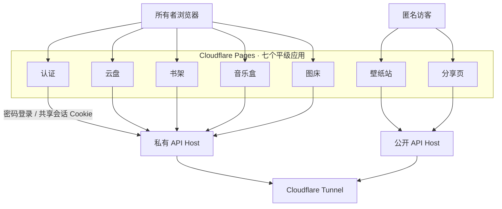
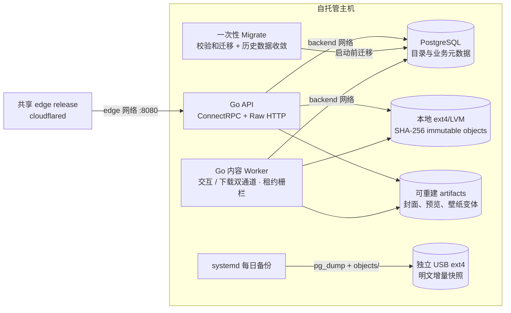
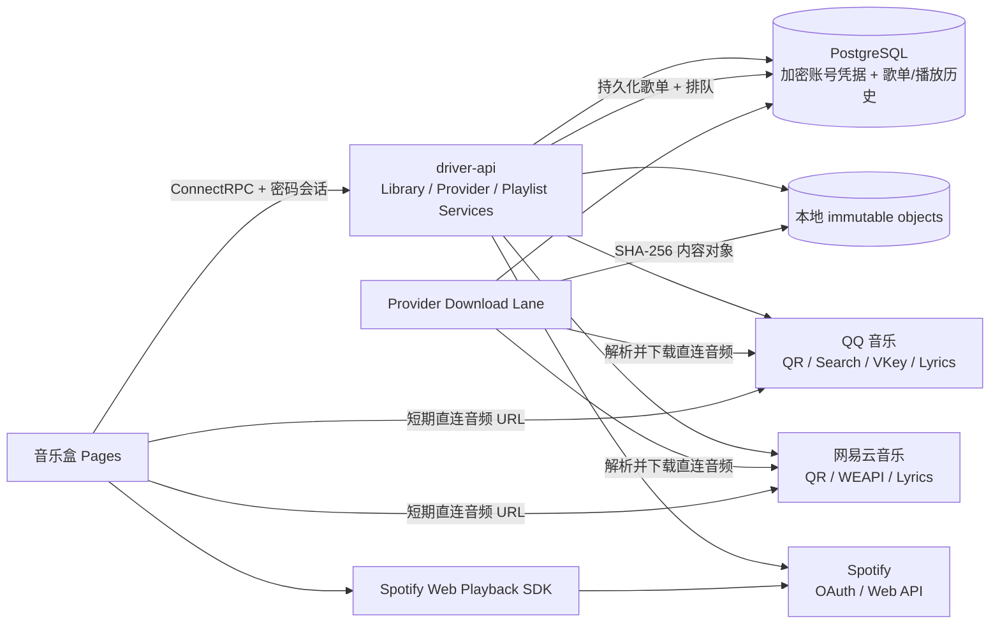
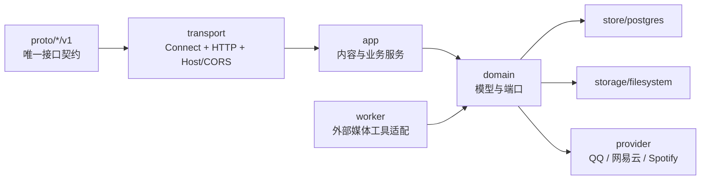

# Local Library

一套以本地硬盘为唯一持久化内容源的个人内容服务。书架、音乐盒、图床、壁纸站、云盘和
分享页彼此平级；**云盘不是入口，也不承载其他应用的数据目录**。

前端部署在七个独立的 Cloudflare Pages 项目，两个 API Host 通过同一条 Cloudflare
Tunnel 回到自托管主机。源文件与 PostgreSQL 元数据都只保存在本地，不使用 R2、S3
或 MinIO。音乐盒可以按需连接外部会员账号；导入的 QQ 音乐和网易云歌单可由主机上的
后台 Worker 按用户操作下载到本地内容库，Spotify 仍只通过官方 Web Playback SDK
在线播放。

## 架构

### 应用与访问边界



未登录访问任一私有应用时，该应用将请求地址作为 `return_to` 跳转到认证页。认证页
只负责登录，成功后返回原应用。云盘、书架、音乐盒与图床共用私有 API Host 上的
Host-only 会话 Cookie，但没有任何一个应用被定义为总入口。

### 主机运行时



API、Worker、Migrate 与 PostgreSQL 不向宿主机发布端口。唯一 `cloudflared` connector
属于独立 `deploy/edge` release，通过外部命名网络 `realtime-me-edge` 和稳定别名
`library-api` 访问 API；Library 本身不持有 Tunnel token。PostgreSQL 仅位于内部
`backend` 网络。本机 Worker 通过独立
`provider-egress` 网络访问音乐来源，不监听 HTTP 端口。Migrate 在 API/Worker 启动前
独占 PostgreSQL advisory lock，校验已应用迁移的 SHA-256 后退出。常驻容器配置
`restart: unless-stopped`，数据卷通过 `/etc/fstab` 挂载；运行中任务依靠租约、栅栏
令牌和幂等发布在重启后继续执行。

### 音乐来源



QQ 音乐和网易云由原生 Go Provider 适配器访问，Spotify 只使用官方 OAuth、Web API
与 Web Playback SDK。搜索结果按来源分组，播放队列不会跨来源混合或自动替换音源。
QQ 音乐或网易云曲目已有可见的本地副本时，播放解析会优先返回本地内容 URL。
下载任务会把平台封面转换为有界尺寸的本地 JPEG artifact，不依赖长期外链。
Cookie、refresh token 与临时登录状态使用服务器环境密钥 AES-256-GCM 加密后写入
PostgreSQL；浏览器只会取得 Spotify SDK 必需的短期 access token。

Provider 是编译期插件：Registry 以开放的稳定字符串 ID 注册 Adapter，上层只依赖登录、
二维码轮询、OAuth 回调、目录搜索、歌单导入、播放解析、本地下载、歌词和 SDK Token
等独立能力接口。QQ 音乐与网易云提供歌单导入和本地下载能力；Spotify 只提供歌单
导入与官方播放能力。
不支持某项能力的平台无需提供空实现；描述符把显示名、配置状态和能力列表动态下发给
前端，新增平台不会修改现有 Adapter 或前端枚举。

### 后端分层



音乐契约按 Library、Provider、Playlist 三个服务拆分。传输层不泄漏 `connect.Request`
或 `http.Request` 到业务层；应用服务只依赖按职责收窄的领域端口；
PostgreSQL、文件系统和媒体命令是独立适配器。较长实现按职责拆成查询、命令、处理、
转换与 HTTP 边界文件，避免单文件同时承担多个变化原因。

## 内容模型

- 浏览器上传走通用可续传分片协议；写完分片后由 Worker 异步校验范围、计算摘要并
  发布内容对象，目标应用只执行常数时间的事务认领。
- 源文件按 SHA-256 发布到 `objects/sha256/<前缀>/<摘要>`；相同内容只存一份。
- 云盘文件只引用内容对象；书籍、音乐和图片拥有独立业务记录，不放进云盘目录树。
- PDF/EPUB 元数据、音频标签、图片尺寸和衍生文件由独立 Worker 异步处理。
- `artifacts/` 保存书封、专辑封面、图片预览和响应式壁纸，属于可重建缓存。
- 未引用内容先写入 48 小时 tombstone，再删除物理文件；每小时还会对超过保护期且
  没有数据库所有者的对象与 artifact 做加锁复核，收敛崩溃留下的孤儿文件。
- 图床匿名链接只读原图；壁纸站只读取手动发布的图片。
- 各私有应用拥有独立回收站，支持恢复、永久删除和清空；30 天后自动清理。
- 第三方音乐保存加密账号凭据、导入歌单和播放历史，不持久化短期播放 URL；只有用户
  主动执行“存入本地”后，QQ 音乐和网易云音频才进入相同的 SHA-256 内容库。

数据目录：

```text
DATA_ROOT/
├── objects/sha256/   # 唯一需要随数据库备份的不可变源文件
├── artifacts/        # 可由 Worker 重建
├── uploads/          # 未完成上传，不备份
└── work/             # Worker 临时目录，不备份
```

## 备份与恢复

`deploy/library/scripts/backup.sh` 每日生成：

1. 一份 PostgreSQL custom-format dump；
2. 一份 `objects/` 明文 rsync 快照；
3. 与上一份快照之间通过 hard link 复用未改变对象；
4. 默认只保留最近 30 次成功快照。

因此 30 份快照不会把未变化文件复制 30 次；新增占用主要来自新源文件和每份数据库
dump。备份盘必须是独立挂载点，脚本会检查所有权、标记文件与剩余空间。

数据库备份中的音乐账号凭据仍为应用层密文。`MUSIC_PROVIDER_CREDENTIAL_KEY` 不写入
数据库或仓库，必须随主机秘密单独保管；丢失后本地媒体不受影响，但第三方账号需要重连。

灾难恢复使用 `deploy/library/scripts/restore.sh`。该脚本恢复数据库和不可变对象，清空衍生缓存，
校验 dump、清单、对象数量与逻辑字节数，然后运行当前迁移并为书籍、音乐、图片、
壁纸、未完成歌单和下载重新排队。Worker 会自动重建全部 artifacts。恢复是
显式破坏性操作，必须传入 `--confirm-destroy`。

## 仓库结构

| 路径 | 职责 |
| --- | --- |
| `proto/realtime/me/library` | Auth、Content、Drive、Books、Music、Images、Wallpapers、System 契约 |
| `services/library/cmd/server` | 私有/公开 API 进程 |
| `services/library/cmd/worker` | 本地内容处理进程 |
| `services/library/internal` | 领域、应用、存储、PostgreSQL、传输与 Worker 实现 |
| `apps/web/library/auth` | 唯一密码登录页 |
| `apps/web/library/drive` | 通用文件管理 |
| `apps/web/library/books` | PDF.js / EPUB.js 阅读与书架 |
| `apps/web/library/music` | 本地音乐、会员来源搜索、歌单导入/下载、双播放引擎、歌词与统一历史 |
| `apps/web/library/images` | 图片、相册、匿名直链与壁纸发布 |
| `apps/web/library/wallpapers` | 匿名壁纸浏览与下载 |
| `apps/web/library/share` | 匿名只读文件分享 |
| `packages/library-contracts-web` | Buf 生成的 TypeScript 契约 |
| `packages/library-web` | Library API client、认证、上传与业务组件 |
| `packages/web-ui` | Status 与 Library 共用的基础 UI primitives |
| `deploy/{edge,library,web}` | Tunnel、主机运行时和 Web 三个独立发布单元 |

## 本地开发

仓库不保存真实域名、Pages 项目名、Tunnel 标识、主机地址或凭据。示例配置中的
占位符必须复制到被 Git 忽略的本地文件后再替换。

```sh
pnpm install
make generate
make verify
```

七个 Vite 开发服务默认端口为：认证 `5173`、云盘 `5174`、书架 `5175`、音乐盒
`5176`、图床 `5177`、壁纸站 `5178`、分享页 `5179`。生产发布所需的全部应用
Origin 和 Pages 项目名由本地 `deploy/web/pages.env` 提供。

## 部署

1. 启动 `deploy/edge`，创建外部 `realtime-me-edge` network 和唯一 connector；
2. 复制 `deploy/library/.env.example` 到主机的 `/etc/cloud-drive/runtime.env` 并设置为 `0600`；
3. 通过 `deploy/library/scripts/initialize-storage.sh` 初始化并持久挂载数据卷；
4. 运行 `deploy/library/scripts/deploy.sh` 启动 PostgreSQL、Migrate、API 与 Worker；
5. 复制 `deploy/web/pages.env.example` 到本地 `deploy/web/pages.env`；
6. 运行 `deploy/web/deploy-library-pages.sh` 构建并发布七个 Pages 项目；
7. 安装备份 timer，并至少执行一次手动备份和恢复演练。

启用 Spotify 时，还需在私有运行时配置中同时设置 Client ID/Secret，并在 Spotify
Dashboard 注册由私有 API Origin 生成的 `/v1/music/providers/spotify/callback`。QQ
音乐与网易云无需额外应用密钥。

详细主机命令、变量和操作入口见 [`deploy/library/README.md`](../../deploy/library/README.md)。

## 验证门禁

本项目不维护测试文件。`make verify` 执行 Proto lint、Go 格式检查/vet/build、前端
生成代码漂移检查、Biome/typecheck/build、Shell 语法检查与 ShellCheck。部署前还应渲染 Compose
配置，并在目标环境验证健康检查、Worker 心跳、七个 Pages 与匿名读取边界。
