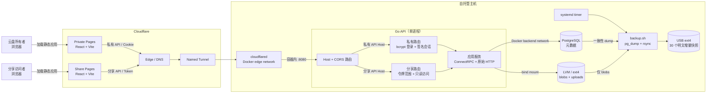
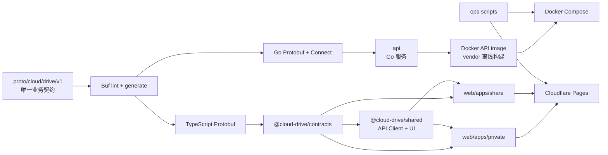

# Cloud Drive

个人私有云盘，文件保存在部署主机本地 LVM 数据卷，通过 Cloudflare Pages 与 Tunnel 提供访问。

## 架构

### 运行时拓扑



浏览器直接从两个 Pages 项目加载静态资源，再通过两个独立 API Host 进入同一条
Tunnel。主机不发布 API 或 PostgreSQL 端口：`cloudflared` 只能通过 `edge` 网络访问
API，PostgreSQL 只能通过内部 `backend` 网络被 API 访问。

### 契约与发布流



| 层级 | 目录 | 职责 |
| --- | --- | --- |
| 业务契约 | `proto` | 定义 `cloud.drive.v1` 消息与服务，并生成 Go/TypeScript 契约 |
| 私有前端 | `web/apps/private` | 密码登录、文件管理、上传、回收站、分享管理与文件预览 |
| 分享前端 | `web/apps/share` | 解析分享令牌、只读浏览、预览与下载 |
| 前端公共层 | `web/packages` | 生成契约、ConnectRPC 客户端、共享组件和格式化逻辑 |
| 后端 | `api` | Host 隔离、认证、分享授权、业务服务、PostgreSQL 与文件系统适配器 |
| 运维 | `ops` | Compose、Tunnel token 挂载、LVM 初始化、Pages 发布和明文增量备份 |

### 数据与安全边界

- PostgreSQL 只保存目录树、上传会话和分享链接等元数据；文件内容写入 LVM 数据卷。
- 私有 API 除健康检查与登录外均要求 24 小时签名会话 Cookie，并严格校验 Origin。
- 分享 API 只挂载解析、目录浏览、预览和下载能力；分享令牌决定可读范围。
- 上传使用有界分片和临时 `uploads/`，完成后发布为 `blobs/`；备份不包含未完成分片。
- 回收站支持恢复、单项永久删除和清空；未手动处理的项目在 30 天后自动清理。
- 每日备份将 PostgreSQL 一致性 dump 与 `blobs/` 写入独立 USB 上的明文增量快照，保留最近 30 份。

实际域名、Cloudflare 项目名、Tunnel 标识、部署主机、卷组和容量均为部署时配置，
不写入版本控制。仓库中的 `example.com` 仅为文档占位域名。

私有 API 使用 bcrypt 密码校验和 24 小时签名会话 Cookie；公开分享 API 仅暴露解析、目录浏览、预览和下载路由。分享令牌本身是凭证，默认有效期为 7 天，最长 30 天。

## 本地开发

前端、后端和部署变量都通过相应的 `.env.example` 配置。不要提交真实域名、
Cloudflare 资源标识、主机信息、Tunnel token、数据库密码、登录密码或会话密钥。

```sh
pnpm install
make generate
make verify
```

完整的主机初始化、Tunnel、Pages、密码配置、备份和手动发布步骤见 `ops/README.md`。

## 验证

本项目不维护单元测试文件。变更以 Proto lint/生成检查、Go 构建与 vet、前端类型检查/构建、Shell 静态检查及 Compose 配置渲染作为验证门禁。
