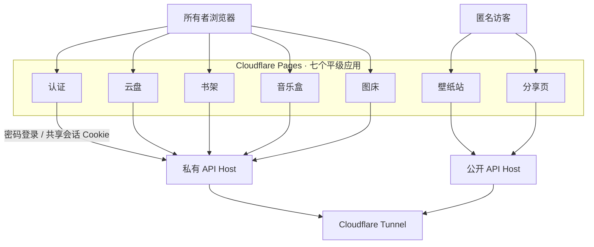
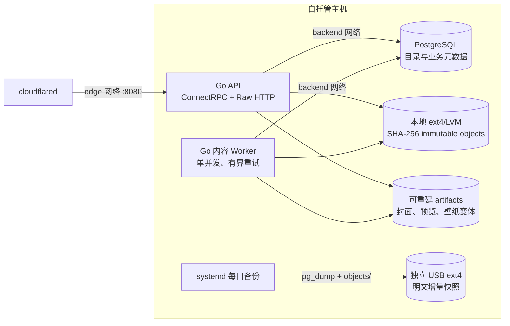
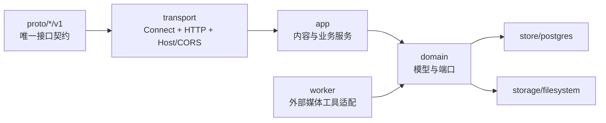

# Local Library

一套以本地硬盘为唯一数据源的个人内容服务。书架、音乐盒、图床、壁纸站、云盘和
分享页彼此平级；**云盘不是入口，也不承载其他应用的数据目录**。

前端部署在七个独立的 Cloudflare Pages 项目，两个 API Host 通过同一条 Cloudflare
Tunnel 回到自托管主机。源文件与 PostgreSQL 元数据都只保存在本地，不使用 R2、S3
或 MinIO。

## 架构

### 应用与访问边界



未登录访问任一私有应用时，该应用将请求地址作为 `return_to` 跳转到认证页。认证页
只负责登录，成功后返回原应用。云盘、书架、音乐盒与图床共用私有 API Host 上的
Host-only 会话 Cookie，但没有任何一个应用被定义为总入口。

### 主机运行时



API、Worker 与 PostgreSQL 不向宿主机发布端口。`cloudflared` 只能通过 Compose 的
`edge` 网络访问 API，PostgreSQL 仅位于内部 `backend` 网络。所有容器都配置
`restart: unless-stopped`，数据卷通过 `/etc/fstab` 挂载，因此主机重启后可自行恢复。

### 后端分层



传输层不泄漏 `connect.Request` 或 `http.Request` 到业务层；应用服务只依赖领域端口；
PostgreSQL、文件系统和媒体命令是独立适配器。较长实现按职责拆成查询、命令、处理、
转换与 HTTP 边界文件，避免单文件同时承担多个变化原因。

## 内容模型

- 浏览器上传走通用可续传分片协议，完成后才由目标应用认领。
- 源文件按 SHA-256 发布到 `objects/sha256/<前缀>/<摘要>`；相同内容只存一份。
- 云盘文件只引用内容对象；书籍、音乐和图片拥有独立业务记录，不放进云盘目录树。
- PDF/EPUB 元数据、音频标签、图片尺寸和衍生文件由独立 Worker 异步处理。
- `artifacts/` 保存书封、专辑封面、图片预览和响应式壁纸，属于可重建缓存。
- 图床匿名链接只读原图；壁纸站只读取手动发布的图片。
- 各私有应用拥有独立回收站，支持恢复、永久删除和清空；30 天后自动清理。

数据目录：

```text
DATA_ROOT/
├── objects/sha256/   # 唯一需要随数据库备份的不可变源文件
├── artifacts/        # 可由 Worker 重建
├── uploads/          # 未完成上传，不备份
└── work/             # Worker 临时目录，不备份
```

## 备份与恢复

`ops/scripts/backup.sh` 每日生成：

1. 一份 PostgreSQL custom-format dump；
2. 一份 `objects/` 明文 rsync 快照；
3. 与上一份快照之间通过 hard link 复用未改变对象；
4. 默认只保留最近 30 次成功快照。

因此 30 份快照不会把未变化文件复制 30 次；新增占用主要来自新源文件和每份数据库
dump。备份盘必须是独立挂载点，脚本会检查所有权、标记文件与剩余空间。

灾难恢复使用 `ops/scripts/restore.sh`。该脚本恢复数据库和不可变对象，清空衍生缓存，
然后为书籍、音乐、图片与壁纸重新排队。Worker 会自动重建全部 artifacts。恢复是
显式破坏性操作，必须传入 `--confirm-destroy`。

## 仓库结构

| 路径 | 职责 |
| --- | --- |
| `proto` | Auth、Content、Drive、Books、Music、Images、Wallpapers、System 契约 |
| `api/cmd/server` | 私有/公开 API 进程 |
| `api/cmd/worker` | 本地内容处理进程 |
| `api/internal` | 领域、应用、存储、PostgreSQL、传输与 Worker 实现 |
| `web/apps/auth` | 唯一密码登录页 |
| `web/apps/drive` | 通用文件管理 |
| `web/apps/books` | PDF.js / EPUB.js 阅读与书架 |
| `web/apps/music` | 原音频播放、收藏与历史 |
| `web/apps/images` | 图片、相册、匿名直链与壁纸发布 |
| `web/apps/wallpapers` | 匿名壁纸浏览与下载 |
| `web/apps/share` | 匿名只读文件分享 |
| `web/packages/contracts` | Buf 生成的 TypeScript 契约 |
| `web/packages/shared` | API 客户端、shadcn/ui 组件和跨应用框架 |
| `ops` | Compose、Pages、主机初始化、备份与恢复脚本 |

## 本地开发

仓库不保存真实域名、Pages 项目名、Tunnel 标识、主机地址或凭据。示例配置中的
占位符必须复制到被 Git 忽略的本地文件后再替换。

```sh
pnpm install
make generate
make verify
```

七个 Vite 开发服务默认端口为：认证 `5173`、云盘 `5174`、书架 `5175`、音乐盒
`5176`、图床 `5177`、壁纸站 `5178`、分享页 `5179`。生产发布所需的全部应用
Origin 和 Pages 项目名由本地 `ops/pages.env` 提供。

## 部署

1. 复制 `ops/.env.example` 到主机的 `/etc/cloud-drive/runtime.env` 并设置为 `0600`；
2. 通过 `ops/scripts/initialize-storage.sh` 初始化并持久挂载数据卷；
3. 将 Tunnel token 单独保存为 root-only 文件；
4. 运行 `ops/scripts/deploy.sh` 启动 PostgreSQL、API、Worker 与 cloudflared；
5. 复制 `ops/pages.env.example` 到本地 `ops/pages.env`；
6. 运行 `ops/scripts/deploy-pages.sh` 构建并发布七个 Pages 项目；
7. 安装备份 timer，并至少执行一次手动备份和恢复演练。

详细主机命令、变量和操作入口见 [`ops/README.md`](ops/README.md)。

## 验证门禁

本项目不维护测试文件。`make verify` 执行 Proto lint、Go 格式检查/vet/build、前端
Prettier/typecheck/build、Shell 语法检查与 ShellCheck。部署前还应渲染 Compose
配置，并在目标环境验证健康检查、Worker 心跳、七个 Pages 与匿名读取边界。
